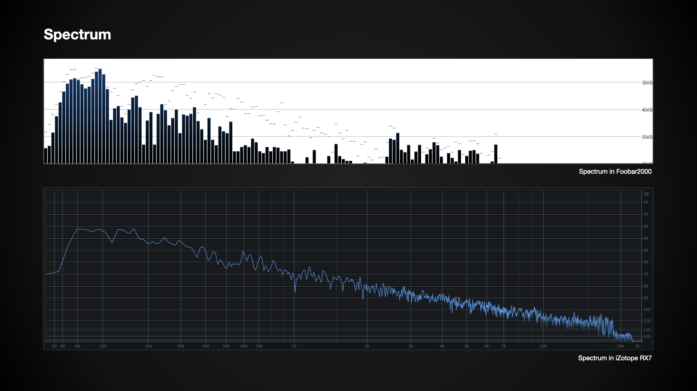
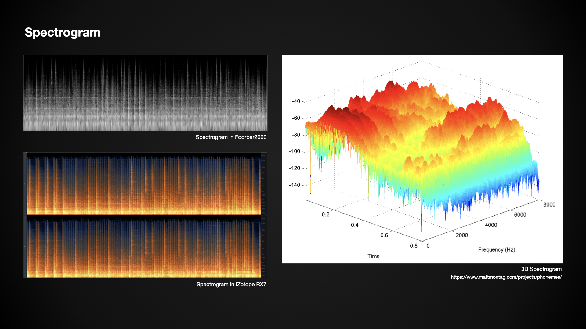
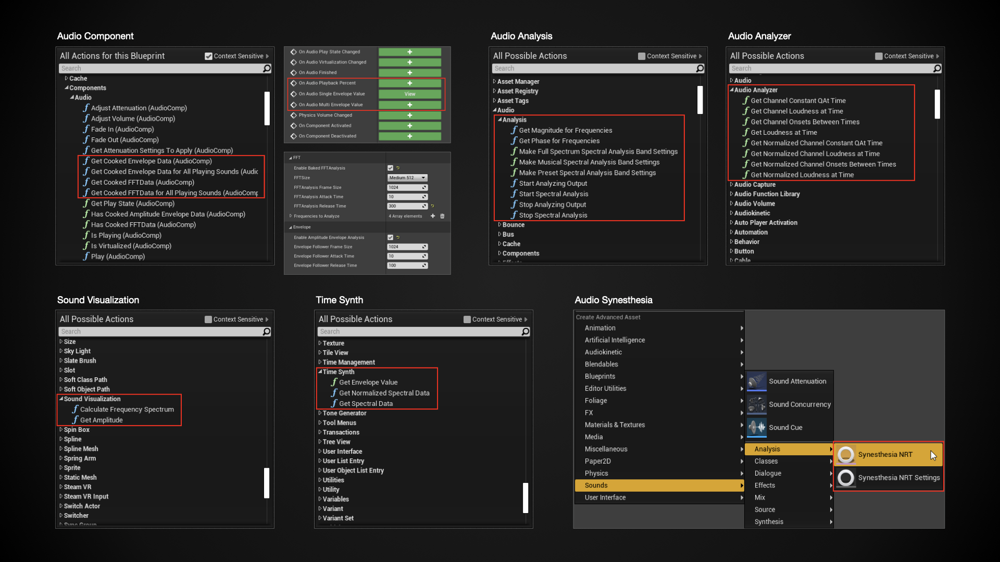
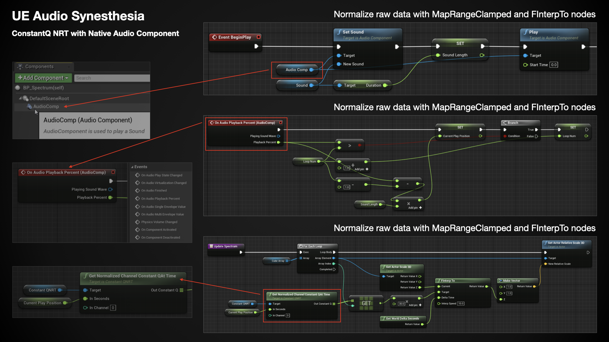

# “音频可视化” UE & Wwise 实践案例

继上一篇文章[《“音乐作为关卡设计” UE & Wwise 实践案例》](https://github.com/SounDoer/Xichen_GADD/blob/main/A-Practice-of-Music-as-Level-Design-with-UE-Wwise.md)中运用音乐中的标记信息来触发游戏事件之后，我想在个人练习项目里想实现的下一个功能是用音乐中的信息来驱动视觉效果的表现，也就是通常说的音频可视化（Audio Visualization）。\
音频可视化本身是一个大课题，在数字艺术和现场表演等领域已经有了成熟的工具和艺术表达。本文不讨论艺术方面的表现效果，也不深究音频信号的数理定义，仅从基本概念入手，结合引擎工具 Unreal Engine 和音频中间件 Wwise 已有的功能，来实现一些基本的音频可视化效果。
```
开发环境与工具：
Unreal Engine 4.26 C++ & Blueprint
Audiokinetic Wwise 2021.1.0
```

### 音频可视化的元素

对于数字音频信号的分析，通常可以从**时域**（Time Domain）和**频域**（Frequency Domain）两个方面入手，相关的分析工具和表现形式在各类播放器和音频工具中其实都很常见。

简单来说，从时域上分析可以得知音频信号的能量大小随时间变化的情况，根据不同的计算与加权方式可以表示各种与能量相关的数值情况。比如，峰值（Peak）表现在声音波形（Waveform）上就是波形最外层的包络曲线（Envelope），响度（Loudness）表现在表头上就是实时变化的数值指示。


从频域上分析可以得知某一时刻音频信号的能量在频率上的分布情况，即常见的频谱图（Spectrum）所表示的各个频段在人耳可闻频谱范围内的能量大小。



除此之外，还有一种将时域和频域信息整合在一起的可视化方式，即时频谱（Spectrogram），3D 形式的时频谱也因其立体形象而被叫做“瀑布图”。



下文将以实现上述三种可视化效果来展开。

### 结合现有工具的实现思路

由于项目已有的音频功能都是基于中间件 Wwise 的，音频可视化的实现也需要统一在同一框架下，因此具体的实现方式也多了一些限制和要求：
1. 由于编程水平有限，尽量不考虑自己写代码的方式来实现；
2. 据我了解，除了 Wwise Meter 插件之外，目前 Wwise 并没有直接与音频分析相关的功能，无法从 Wwise 中便捷地获取频谱相关的声音信息；
3. 如下图，UE 引擎确实有不少与音频分析相关的功能，但需要在其自身的音频系统框架下使用，这样一来，声音资源的管理和控制都将与 Wwise 脱节，因此也不适用；


所以，一种可行的实现思路是，利用 UE 引擎中的功能对声音文件进行分析并存储相应的数据，然后通过 Wwise 控制声音的播放并调用对应时刻的信息。

### 时域：声音包络（Envelope）

首先从相对简单的 Envelope 入手。从数据类型来看，音频信号在时域上的瞬时值可以理解为是一个随时间快速变化的浮点数变量，可以直接用来驱动视觉元素的各种参数；更进一步，可以将一段时间内的变量数值先存储进数组，然后用数组来驱动视觉元素的变化，这样就能表现出音频信号在一段时间内的 Envelope 形态。

如上一节实现思路中所提到的，想尽可能在 Wwise 框架下实现功能，而 Wwise Meter 插件正好可以满足这一要求。在中间件内 Audio Bus 上使用 Wwise Meter 插件来获取音频信号的时域瞬时值，然后映射到创建的 Game Parameter 上，最后在引擎中通过 GetRTPCValue 节点来获取该数值。


在引擎中获取到该数值后，首先通过 MapRangeClamped 和 FInterpTo 节点对数据进行标准化和平滑处理。然后，将数据存入一个定长的浮点数数组中，数组长度可以根据需要展示的 Envelope 长度来决定。更新数组内数据的思路是，在每一次 Tick 时，最新的数值永远存储在数组的最开头位置，数组之后的位置依次复制前一位的数值，这样就能将一段时间内的数值变化存储下来并且持续进行更新。如果以每秒 60 帧的 Tick 速率来计算，长度为 60 的数组可以记录 1 秒内的数值变化。最后，就可以用该数组内的数据来同步驱动视觉元素的表现了。


效果如下动图。


### 频域：声音频谱（Spectrum）

二维数组





### 时域与频域：声音时频谱（Spectrogram）


### 更进一步的代码实现


#### Reference

[Unreal Engine Blueprint API Reference - Audio Component](https://docs.unrealengine.com/en-US/BlueprintAPI/Audio/Components/Audio/index.html)\
[Unreal Engine Blueprint API Reference - Audio Analysis](https://docs.unrealengine.com/en-US/BlueprintAPI/Audio/Analysis/index.html)\
[Unreal Engine Blueprint API Reference - Audio Analyzer](https://docs.unrealengine.com/en-US/BlueprintAPI/AudioAnalyzer/index.html)\
[Unreal Engine Blueprint API Reference - Sound Visualization](https://docs.unrealengine.com/en-US/BlueprintAPI/SoundVisualization/index.html)\
[Unreal Engine Blueprint API Reference - Time Synth](https://docs.unrealengine.com/en-US/BlueprintAPI/TimeSynth/index.html)\
[Unreal Engine 4 Documentation - Audio Synesthesia](https://docs.unrealengine.com/en-US/WorkingWithMedia/Audio/Synesthesia/index.html)\
[Wwise Help - Wwise Meter](https://www.audiokinetic.com/library/edge/?source=Help&id=wwise_meter_plug_in_effect)


希辰\
2021.4.3

***