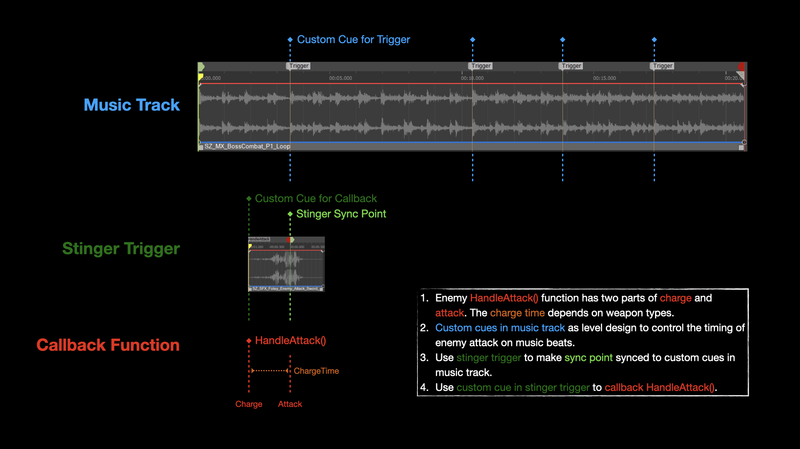
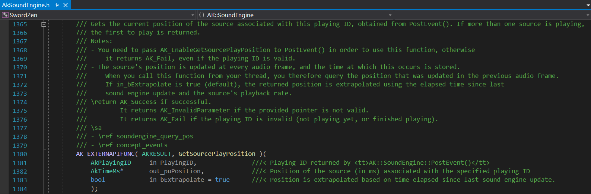
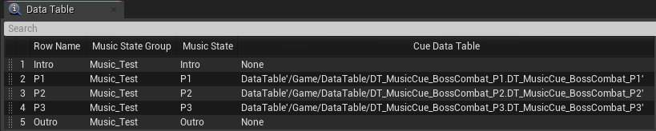
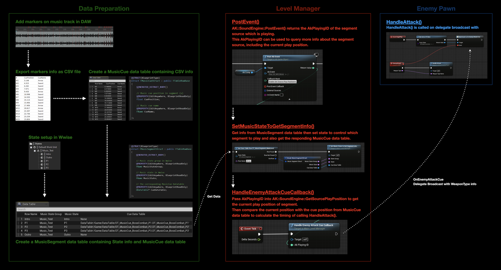

# “音乐作为关卡设计” UE & Wwise 实践案例

2021年1月 Global Game Jam，我与叶梓涛做了一款着重声音体验的禅意动作游戏[《剑入禅境 Sword Zen》](https://yezi.itch.io/sz)。受限于 GameJam 开发时间，当时的设计想法并没有能够彻底实现；不少玩家朋友们试玩之后发来了反馈，也让我们有了新的灵感。因此正好把这个项目作为个人的游戏开发练习，我从核心声音体验和玩法扩展性的角度入手开始重新编写代码。\
在完成了原有玩法的重构之后，将要进行的一个最大的设计改动就是要让玩家的操作与游戏中的音乐产生更强的关联。音乐不再只是游戏进度的提示和主观情绪的表达，而是要能提供更类似于音乐节奏游戏中“音乐作为关卡设计”的功能。比如，通过音乐中的节拍点来控制敌人的攻击行为，这样的话玩家作出相应反馈时的格挡成功与失败的时间点都会统一在音乐整体的节奏中，给玩家一种类似音游的打击爽快感；同时，这也为之后互动音乐的设计提供了更多可能性，根据玩家单次或多次的格挡结果来顺畅地衔接不同的音乐片段，引导玩家情绪和切换游戏阶段。\
接下来我将使用游戏引擎 Unreal Engine 和音频中间件 Wwise 工具，以“音乐节拍信息控制敌人攻击行为”为例，来详细分析一下设计思路和代码实现的具体过程。
```
开发环境与工具：
Unreal Engine 4.26 C++ & Blueprint
Audiokinetic Wwise 2019.2.9
```

### 明确设计需求


首先需要明确具体的设计需求。如上图所示，敌人的攻击行为由带有一个参数的 HandleAttack(WeaponType) 函数控制，WeaponType 决定了所用武器的各类属性，其中与此处设计相关的数值是 Charge Time，即不同武器有着不同的充能时间。HandleAttack 函数执行时首先获取当前的 WeaponType，然后进行 Start Charge，在经过 Charge Time 之后才实施 Actual Attack。需要实现的设计需求是，敌人在使用不同武器时（即 Charge Time 可变的情况下），Actual Attack 实施的时间点都将与音乐中的节拍点保持一致。\
其实在 Wwise 中通过音乐内的标记信息来触发函数的功能实现并不复杂，原生 API 中的 PostEvent() 函数本身就开放了回调函数（Callback Function）。**只不过，这个案例的设计需求稍微有些不同的地方是，音乐中需要标记的时间点确实是在节拍点上，但实际调用函数的时间点却是在标记的节拍点之前，且调用函数的提前时间量是由游戏中的参数来实时决定的，因此每次实施攻击时都需要进行额外的计算。**

### 尝试使用 Wwise Trigger 功能

如上一节所说，Wwise 本身已有根据音乐标记信息触发回调函数的功能，对于需要提前触发且对齐节拍点的设计需求，我首先想到的是利用 Wwise 提供的 Trigger 功能。



如上图所示，使用 Trigger 功能进行实现的设计思路是：在 Stinger 声音片段（此处可以理解为是开始攻击时的武器 Whoosh 音效）中，调整 Sync Point 用于对齐 Music Track 中节拍点的 Custom Cue 标记信息，并在 Stinger 片段开头添加用于真正触发回调函数的 Custom Cue 标记信息。游戏运行过程中在任意时刻触发 Trigger，受 Trigger 控制的 Stinger 片段都将响应 Music Track 中下一个标记信息点，只要 Stinger 片段开头的标记信息能够被触发，那就验证此方案可行。


但是！在 UE 中使用 Blueprint 进行快速验证后发现，通过 PostEvent 的方式触发 Trigger，由 Trigger 控制的 Stinger 中包含的 Custom Cue 信息无法被获取；进一步研究 Wwise SDK 后发现，通过 PostTrigger 的方式直接触发 Trigger 也不可行，此函数并没有开放任何与回调函数相关的接口。


至此，尝试使用 Wwise Trigger 功能来实现“嵌套式”的 Custom Cue 触发回调函数的方式验证不可行。

### 那就自己动手写吧


既然上述方案无法实现，那就只能跳出现有思路框架，自己动手实现了，需要解决的核心问题就是如何实时地计算出调用 HandleAttack() 函数的时间点。而所谓的时间点对应到 Music Track 上其实就是播放位置（Play Position），因此函数调用时机的判断条件转化为算术表达式就是：
* 节拍点位置（Cue Position）- 当前播放位置（Current Position）< 武器充能时间长度（Charge Time Length）

另外，考虑到音乐循环播放的情况，为了确保当前播放位置永远是与当前播放片段中的下一个节拍点进行比较，还有一个判断条件需要满足：
* 节拍点位置（Cue Position）> 当前播放位置（Current Position）

所以，只要设法获取到节拍点位置和当前播放位置的信息就能计算出调用函数的时间点。

#### 获取当前播放位置信息



配合使用 AkCallbackType 标志 `AK_EnableGetSourcePlayPosition`，`AK::SoundEngine::PostEvent` 返回当前播放声音片段的 `AkPlayingID`，将此 ID 传入 `AK::SoundEngine::GetSourcePlayPosition` 即可获得当前的播放位置。

注：有需要的话可以使用 `AK::MusicEngine::GetPlayingSegmentInfo`，从返回的 `AkSegmentInfo` 中获取更多信息。

首先在 AkGameplayStatics 类中创建一个封装 `AK::SoundEngine::GetSourcePlayPosition` 的函数，便于之后在 C++ 或 Blueprint 中调用。

`AkGameplayStatics.h`
```
	UFUNCTION(BlueprintCallable, BlueprintCosmetic, Category = "SZ | Wwise")
	static int32 GetSourcePlayPosition(int32 PlayingID);
```

`AkGameplayStatics.cpp`
```
int32 UAkGameplayStatics::GetSourcePlayPosition(int32 PlayingID)
{
	AkTimeMs CurrentPosition = 0;
	auto Result = AK::SoundEngine::GetSourcePlayPosition(PlayingID, &CurrentPosition);

	if (Result == AK_Success)
	{
		return CurrentPosition;
	}
	else
	{
		GEngine->AddOnScreenDebugMessage(-1, 2.f, FColor::Red, TEXT("GetSourcePlayPosition FAILED!"), false);
		return -1;
	}
}
```

需要注意的是，Blueprint 中的 PostEvent 节点默认隐藏了 `AK_EnableGetSourcePlayPosition` 标志，因此需要做一些额外的修改将其暴露出来。在 AkGameplayTypes 类中的 `enum class EAkCallbackType` 部分添加以下信息。

`AkGameplayTypes.h`
```
EnableGetSourcePlayPosition = 20 UMETA(Tooltip = "Enable play position info for AK::SoundEngine::GetSourcePlayPosition()."),
```
```
CHECK_CALLBACK_TYPE_VALUE(EnableGetSourcePlayPosition);
```

这样一来就能在 PostEvent 节点中的 Callback Mask 下拉菜单里选择 Enable Get Source Play Position 选项了。


#### 获取节拍点位置信息

首先在 DAW 中对音乐的节拍点进行标记，并将其导出成 .csv 文件。之后创建 `MusicCueStruct.h` 和相对应的 MusicCue Data Table，并将 .csv 文件信息导入其中。

```
#pragma once

#include "CoreMinimal.h"
#include "Engine/DataTable.h"
#include "MusicCueStruct.generated.h"

USTRUCT(BlueprintType)
struct FMusicCueStruct : public FTableRowBase
{
	GENERATED_USTRUCT_BODY()

	// Music cue position in segment (s)
	UPROPERTY(EditAnywhere, BlueprintReadOnly)
	float CuePosition;

	// Music cue name
	UPROPERTY(EditAnywhere, BlueprintReadOnly)
	FName CueName;
};
```


考虑到仍然需要使用 Wwise State 来切换音乐片段，切换的同时需要加载对应片段的 MusicCue Data Table，因此需要创建 `MusicSegmentStruct.h` 和相对应的 MusicSegment Data Table，将 Wwise State 和 MusicCue Data Table 进行统一管理和调用。

```
#pragma once

#include "CoreMinimal.h"
#include "Engine/DataTable.h"
#include "MusicSegmentStruct.generated.h"

USTRUCT(BlueprintType)
struct FMusicSegmentStruct : public FTableRowBase
{
	GENERATED_USTRUCT_BODY()

	// Music state group in Wwise
	UPROPERTY(EditAnywhere, BlueprintReadOnly)
	FName MusicStateGroup;

	// Music state in Wwise
	UPROPERTY(EditAnywhere, BlueprintReadOnly)
	FName MusicState;

	// The corresponding MusicCue Datatable
	UPROPERTY(EditAnywhere, BlueprintReadOnly)
	UDataTable* CueDataTable;
};
```



最后，创建 `SetMusicStateToGetSegmentInfo()` 函数用于在 Blueprint 中配合 GetDataTableRow 节点来调取上述数据。

```
	UFUNCTION(BlueprintCallable)
	void SetMusicStateToGetSegmentInfo(const FName StateGroup, const FName State, class UDataTable* CueDataTable);
```

```
void AMainLevelManager::SetMusicStateToGetSegmentInfo(const FName StateGroup, const FName State, UDataTable* CueDataTable)
{
	// Set music state...
	UAkStateValue* StateValue = nullptr;
	UAkGameplayStatics::SetState(StateValue, StateGroup, State);
	
	// Get corresponding cue data table...
	MusicCueDataTable = CueDataTable;
	
	// Get initial info...
	GetHandleEnemyAttackCueInfo();
}
```

其中 `GetHandleEnemyAttackCueInfo()` 用于进一步处理 MusicCue Data Table，从中获取节拍点位置和武器充能时间长度的信息。

```
void AMainLevelManager::GetHandleEnemyAttackCueInfo()
{
	if (MusicCueDataTable)
	{
		MusicCueRowNameArray = MusicCueDataTable->GetRowNames();
		FName MusicCueRowName = MusicCueRowNameArray[MusicCueRowNameArrayIndex];
		FMusicCueStruct* MusicCue = MusicCueDataTable->FindRow<FMusicCueStruct>(MusicCueRowName, TEXT(""), true);

		if (ensure(MusicCue))
		{
			CuePosition = FMath::RoundToInt((*MusicCue).CuePosition * 1000); // Convert to (int32) ms
			WeaponType = (*MusicCue).CueName;
		}
	}

	if (WeaponPropertyDataTable)
	{
		FWeaponPropertyStruct* WeaponProperty = WeaponPropertyDataTable->FindRow<FWeaponPropertyStruct>(WeaponType, TEXT(""), true);
		if (ensure(WeaponProperty))
		{
			ChargeTimeLength = FMath::RoundToInt((*WeaponProperty).WeaponChargeTime * 1000); // Convert to (int32) ms
		}
	}
}
```

#### 计算函数调用时间点

获取了当前播放位置和节拍点位置的信息之后，就可以创建 `HandleEnemyAttackCueCallback()` 函数并依据上述两点判断条件来实时计算函数调用时间点了，且在每次判断为真且执行之后，获取下一个节拍点位置继续进行判断。

```
void AMainLevelManager::HandleEnemyAttackCueCallback(int32 AkPlayingID)
{
	int32 CurrentPosition = UAkGameplayStatics::GetSourcePlayPosition(AkPlayingID);

	if (CuePosition - CurrentPosition < ChargeTimeLength && CuePosition > CurrentPosition)
	{
		bool bIsCallbackTriggered = true;
		
		if (bIsCallbackTriggered)
		{
			OnEnemyAttackCue.Broadcast(WeaponType);

			bIsCallbackTriggered = false;

			MusicCueRowNameArrayIndex += 1;
			if (MusicCueRowNameArrayIndex > MusicCueRowNameArray.Num() - 1)
			{
				MusicCueRowNameArrayIndex = 0;
			}

			GetHandleEnemyAttackCueInfo();
		}
	}
}
```

其中 `OnEnemyAttackCue.Broadcast(WeaponType)` 通过 Delegate 的方式将当前的 WeaponType 信息发送出去，敌人的 HandleAttack() 函数便会根据当前武器类型做出相应的攻击行为。

### 最终实现


如上图，在 Blueprint 中简单使用几个节点即可实现最终的设计需求。

下图为整体的实现思路概览。



### 总结

最后，说回开头提到的“音乐作为关卡设计”的概念。这个案例只是简单地运用了节拍点这一元素，其实声音或音乐中还有很多丰富的元素，比如响度（Loudness）、频率（Frequency）、包络（Envelope）、音色（Timbre）、音调（Pitch）、旋律（Melody）与和弦（Chord）等，都可以被用来驱动游戏内各个方面的表现，甚至是影响玩法。

#### Reference

[Wwise SDK - Integration Details - Events](https://www.audiokinetic.com/library/edge/?source=SDK&id=soundengine_events.html)\
[Wwise SDK - Integration Details - Music Callbacks](https://www.audiokinetic.com/library/edge/?source=SDK&id=soundengine_music_callbacks.html)\
[Wwise SDK - Integration Details - Triggers](https://www.audiokinetic.com/library/edge/?source=SDK&id=soundengine_triggers.html)\
[Wwise SDK - Integration Details - GetSourcePlayPosition](https://www.audiokinetic.com/library/edge/?source=SDK&id=soundengine_query_pos.html)\
[Wwise SDK - GetPlayingSegmentInfo](https://www.audiokinetic.com/library/edge/?source=SDK&id=namespace_a_k_1_1_music_engine_ad10a9fa99ddf21c91718c52da48e460c.html)\
[Wwise SDK - AkSegmentInfo Struct](https://www.audiokinetic.com/library/edge/?source=SDK&id=struct_ak_segment_info.html)\
[Wwise SDK - AkCallbackType](https://www.audiokinetic.com/zh/library/edge/?source=SDK&id=_ak_callback_8h_a948c083ff18dc4c8dfe1d32cb0eb6732.html)\
[Alessandro Fama - Playback position of sounds with Wwise + UE4](https://alessandrofama.com/tutorials/wwise-ue4/playback-position/)\
[UE API - Get Data Table Row](https://docs.unrealengine.com/en-US/BlueprintAPI/Utilities/GetDataTableRow/index.html)


希辰\
2021.3.20

***