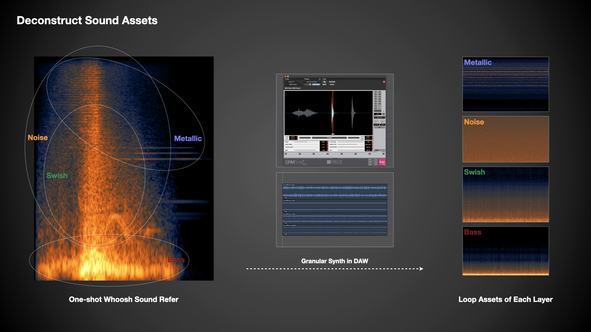

# 冷兵器 Procedural Whoosh 音频设计案例

### Why Procedural?

目前绝大多数游戏中人物角色使用冷兵器的动作表现，几乎都是基于大量逐帧动画资源并通过不同状态来驱动切换和过渡的方式来实现的，因此冷兵器各种挥动动作的声音资源也通常是依据逐帧动画的内容来制作的，然后以与动画资源强绑定的方式来触发的。这样的设计方式能最大程度地保证动作和声音的一致性，以及声音细节表现的可塑性。  
但如果有一款游戏中允许玩家通过鼠标、手柄或者体感设备来直接高自由度地控制冷兵器的挥动，那么上述基于逐帧动画来设计声音的方式就行不通了。声音资源无法依赖确定的动画表现来制作，而是通过玩家输入的动态参数来实时生成与变化的，因此需要用一种更为 Procedural 的方式来实现相应的音频设计需求。本文将使用游戏引擎 Unreal Engine 和音频中间件 Wwise，以光标移动代表冷兵器挥动的抽象方式进行模拟，展开详述整个实现过程，分析并总结目前阶段性测试的利弊与局限。

```
Unreal Engine 4.26
Audiokinetic Wwise 2021.1.0
```

首先，有必要明确一下本文所指的 Procedural 这一概念。正如[《展望游戏音频设计的发展方向》](https://soundoer.github.io/Xichen_GADD/What-will-The-Next-Gen-of-Game-Audio-Design-be-like.html)一文中“程序化音频”章节内提到的，程序化音频的思考重点是物体为什么发声和怎么样发声，而不是简单地只考虑具体的声音表现。以相对宽泛的尺度去考量，其实目前游戏音频设计中许多基于素材并结合动态参数的设计范式都可以被称为是 Procedural 的，两个典型的例子就是汽车引擎和枪械射击。例如，汽车引擎声音的实现特点是有许多如转速之类的动态参数时刻控制着持续性声音的属性变化，枪械射击声音的实现特点则是从枪械发声部位、频段和距离等方面入手准备各个层次的声音素材。而本文所说的 Procedural Whoosh 实现也是基于这类范式的，与汽车引擎的声音实现非常相似，对光标移动轨迹进行实时分析来获取速度、加速度和方向等之类的动态参数，用于控制 Whoosh 各个层次的声音素材的属性变化和混合过渡。

### Deconstruct Sound Assets

冷兵器形态各异种类繁多，长度、材质和使用方式等因素都会直接影响 Whoosh 的声音表现，最终的呈现效果也会有很大程度的夸张和艺术化处理，因此可以对经过设计的 Whoosh 素材资源进行解构，分析其中包含的声音层次，并在此基础上准备相应的素材资源。



在试听大量成品素材并配合 Spectrogram 在时域和频域上的分析之后，大致可以得出规律，即一个经过设计的 Whoosh 声音可以看作是由四个部分组成的：
* **Swish**  
Whoosh 声音的主体部分，能量在频段上的不同分布能够明显体现出冷兵器在材质、形态和重量上的差异感。
* **Bass**  
能量集中的低频部分，在 Swish 主体的基础上进一步提供冲击感。
* **Noise**  
覆盖较宽频段的噪声部分，主要表现高频的嘶嘶声，还可以提供类似粘合剂的作用，顺滑地混合各个频段的声音。
* **Metallic**  
带有金属质感的高频部分，其中明显的基频与谐波成分体现了由金属材质带来的锋利感。


### Calculate Control Parameters

即从光标移动轨迹入手，计算出可以用来描述光标运动特征的各种属性，也就是用于控制声音的各种动态参数。从获取光标屏幕位置开始，通过简单的算术和物理公式就可以依次计算出光标的模拟位置、方向角度、速度、加速度和加速度变化速率。

```
void UAbilityComponent::CalculateCursorPosition(float DeltaSecond)
{
	InterpMousePositionX = FMath::FInterpTo(InterpMousePositionX, GetMousePosition().X, DeltaSecond, CursorPositionInterpSpeed);
	InterpMousePositionY = FMath::FInterpTo(InterpMousePositionY, GetMousePosition().Y, DeltaSecond, CursorPositionInterpSpeed);

	CursorPosition = FVector2D(InterpMousePositionX, InterpMousePositionY);
}
```
对光标屏幕位置做插值平滑处理来得到其模拟位置，并通过 InterpSpeed 数值来控制处理速度，速度越快，模拟位置跟随得就越快，感觉就越跟手。因此，此数值可以进一步与冷兵器重量相关联，用于不同重量下的惯性表现。

```
void UAbilityComponent::CalculateCursorDirection(float DeltaSecond)
{
	FVector2D DeltaPositionVector = CursorPosition - CacheCursorPosition;
	FVector2D DirectionVectorUnit;
	float DirectionVectorLength;
	DeltaPositionVector.ToDirectionAndLength(DirectionVectorUnit, DirectionVectorLength);

	if (CursorVelocity != 0)
	{
		if (DirectionVectorUnit.Y >= 0)
		{
			CursorDirectionAngle = FMath::RadiansToDegrees(FMath::Acos(DirectionVectorUnit.X));
		}
		if (DirectionVectorUnit.Y < 0)
		{
			CursorDirectionAngle = 360.f - FMath::RadiansToDegrees(FMath::Acos(DirectionVectorUnit.X));
		}
	}
}
```
对光标在平面上的单位向量进行计算，将其转换为一维的圆心角角度，并规定0度是X轴的正轴方向。

```
void UAbilityComponent::CalculateCursorVelocity(float DeltaSecond)
{
	float DeltaCursorPosition = FVector2D::Distance(CacheCursorPosition, CursorPosition);
	CacheCursorPosition = CursorPosition;
	CurrentCursorVelocity = DeltaCursorPosition / DeltaSecond;

	CursorVelocity = FMath::GetMappedRangeValueClamped(CursorVelocityClampRange, FVector2D(0, 100), CurrentCursorVelocity);
}
```
计算速度并标准化成范围为0至100的参数。

```
void UAbilityComponent::CalculateCursorAcceleration(float DeltaSecond)
{
	float DeltaCursorVelocity = CurrentCursorVelocity - CacheCursorVelocity;
	CacheCursorVelocity = CurrentCursorVelocity;
	CurrentCursorAcceleration = DeltaCursorVelocity / DeltaSecond;

	CursorAcceleration = FMath::GetMappedRangeValueClamped(CursorAccelerationClampRange, FVector2D(-10, 10), CurrentCursorAcceleration);
}
```
计算加速度并标准化成范围为-10至10的参数。

```
void UAbilityComponent::CalculateCursorAccelSlewRate(float DeltaSecond)
{
	float DeltaCursorAcceleration = FMath::Abs(CursorAcceleration - CacheCursorAcceleration);
	CacheCursorAcceleration = CursorAcceleration;
	CurrentCursorAccelSlewRate = DeltaCursorAcceleration / DeltaSecond;

	CursorAccelSlewRate = FMath::GetMappedRangeValueClamped(CursorAccelSlewRateClampRange, FVector2D(0, 1), CurrentCursorAccelSlewRate);
}
```
计算加速度变化速率并标准化成范围为0至1的参数。此数值主要用于表征光标是否快速来回移动。

### Define Modeling Rules


希辰  
2021.8.26

---