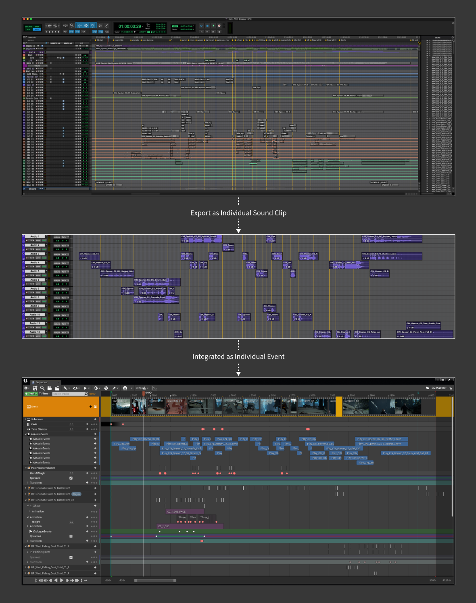
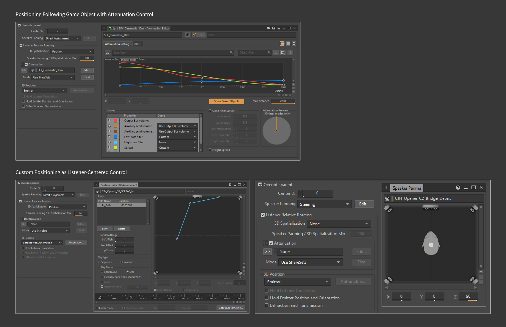
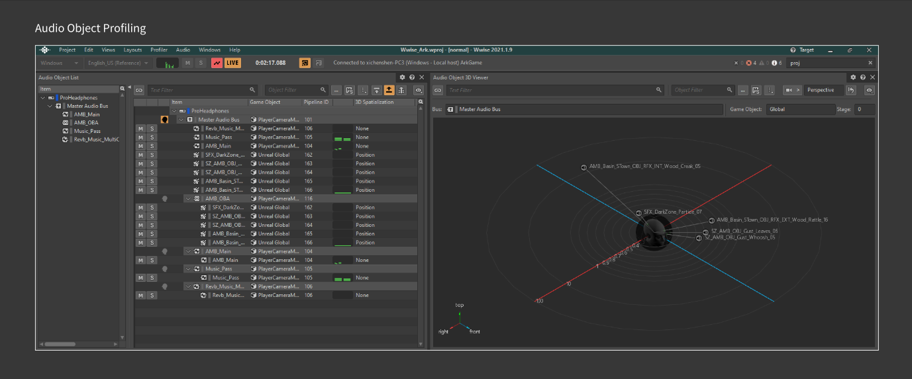
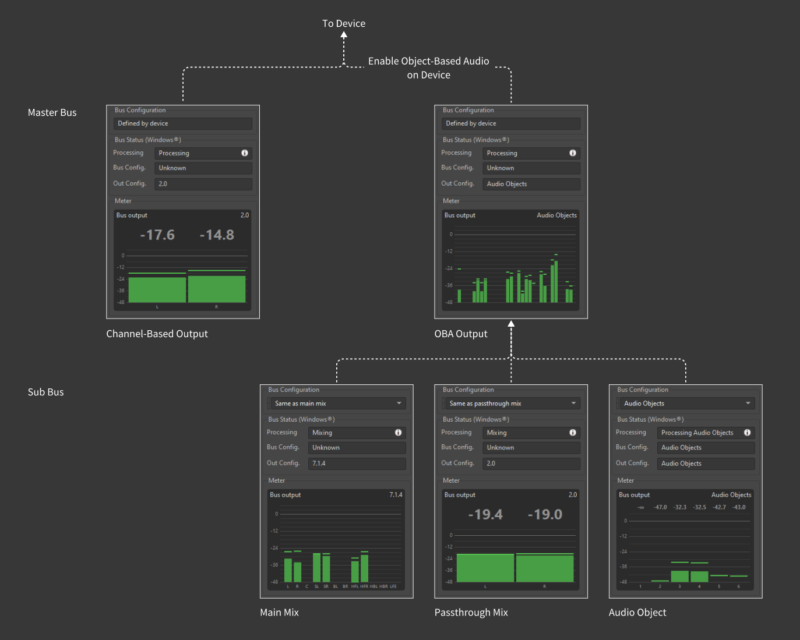
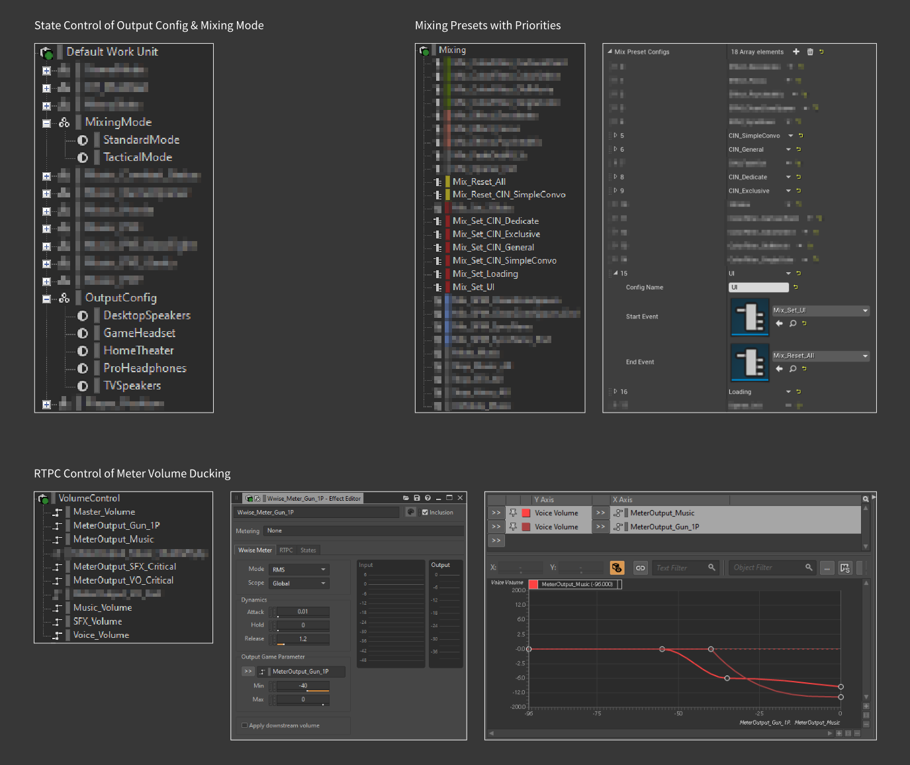
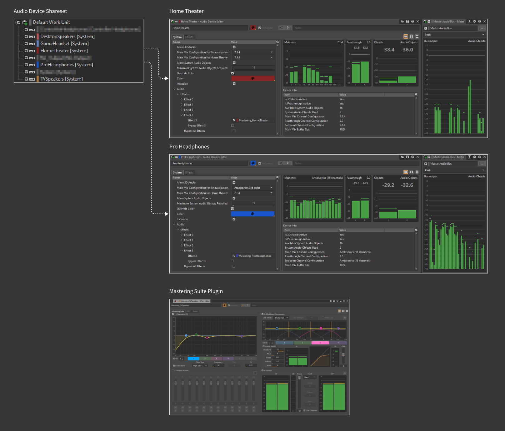
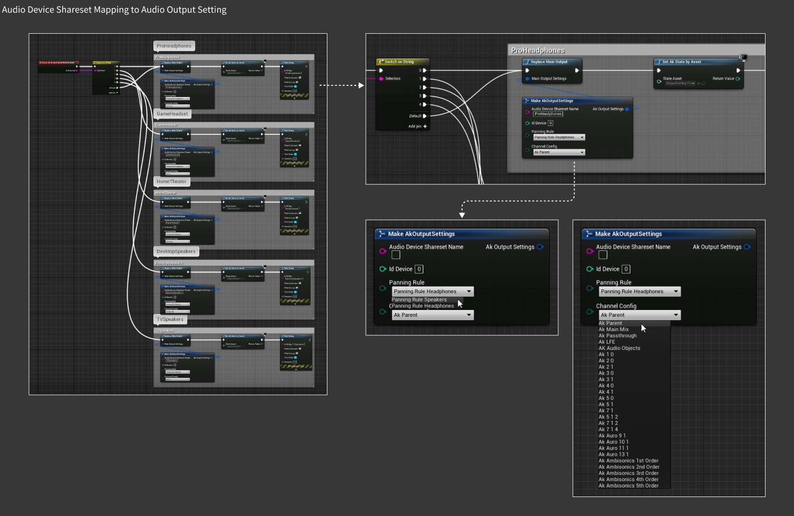
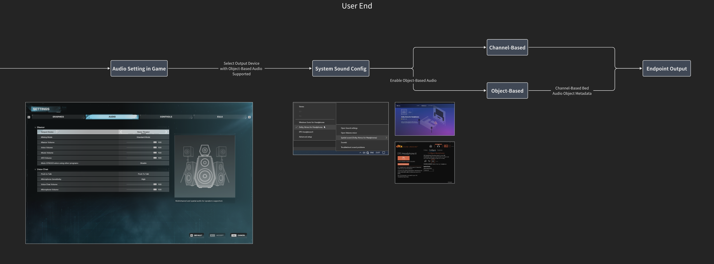

# Object-Based Audio 音频设计与混音案例

***
<!-- Start Document Outline -->

* [What is Object-Based Audio and Why?](#what-is-object-based-audio-and-why)
* [The Pipeline & Workflow](#the-pipeline--workflow)
	* [Asset Production](#asset-production)
	* [Sound Positioning](#sound-positioning)
	* [Bus Structure](#bus-structure)
	* [Audio Device Config](#audio-device-config)
	* [User-End Setup](#user-end-setup)
* [Conclusion](#conclusion)
* [For More Information](#for-more-information)

<!-- End Document Outline -->
***

作为一款支持 PC 和主机平台的第三人称射击游戏，[《SYNCED》](https://www.syncedthegame.com/)在项目早期就确定了高规格的音频交付标准，在保证绝大多数玩家使用耳机的听感效果的同时，还需要适配立体声、多声道环绕声以及带有顶置音箱的影院级配置的各种听音环境。音频中间件 Wwise 在 2021 版本中引入了 Object-Based Audio Pipeline（基于对象音频的管线），配合各个厂商如 Dolby 和 Sony 等在终端设备上提供了更多的渲染支持，《SYNCED》音频组也在第一时间跟进，对项目音频结构和工作管线进行了改造，利用新的工具在各类终端和回放环境下实现高规格的音频交付标准。趁此游戏即将上线之际，本文将以《SYNCED》项目为例，从 Object-Based Audio（以下简称 OBA）这个核心概念出发，分享一下在资源制作、声音定位、管线结构和混音策略等方面的工作细节与经验得失。

## What is Object-Based Audio and Why?

3D Audio、Spatial Audio、Immersive Audio、Binaural Audio 等诸如此类的音频术语，大家肯定都有听说过，笼统地来说这些词多少都透露着同一个的含义，就是更高级的声音体验，尽管 Object-Based Audio 这个概念与上述这些词都有联系，但在具体的专业讨论语境中还是有其自身特殊的定义的。  
从设计概念上来说，Object-Based 与之相对的是 Channel-Based。主流的立体声和多声道环绕声等音频格式和重放技术，是以不断增加声道数量的方式来提升沉浸效果的，通过声像定位和音量调节等方式在时间轴上精细地控制每一时刻从各个声道中输出的声音内容，来模拟声音从各个方位传来的角度与距离，绝大多数线性媒体的声音制作如音乐和电影都是围绕 Channel-Based 声道展开的。而游戏作为一种交互媒体，时间和空间上的不确定性决定了声音内容在各个声道中的输出是需要根据 Listener（听者）和 Emitter（发声体）之间的相对关系进行实时计算来判断的，因此游戏音频设计在资源制作、数据整合以及混音等环节通常是以 Object-Based 基于对象的逻辑展开的。  
从声音重放技术的角度来说，目前的 OBA 方案是在已有 Channel-Based 格式标准的基础上，增加相对独立的、包含声音定位元信息的 Audio Object（音频对象），交由终端设备来进行空间化计算，并根据终端的声道数目和配置来自适应地分配声音信号的输出，提供更加精确的声音定位，以及针对耳机输出的双耳化效果。以 Dolby Atmos 为代表的实现方案在电影声音行业已经有了非常广泛的应用；而在游戏音频领域，PC 和主机平台也都有相应的解决方案，比如 Windows 10 和 XBOX 系统原生 Windows Sonic，PlayStation5 3D Audio 以及第三方产品 Dolby Access 和 DTS Sound Unbound 等。  
在开发工具方面，音频中间件 Wwise 在 2021 版本中引入的 OBA 管线，设计师可以更加快捷直观地设计音频对象和搭建总线结构，并根据不同的终端设备来设置相应的音频输出配置。另外，Dolby Atmos 在支持音频中间件 Wwise 和 FMOD 的基础上，也更新了针对 Unreal Engine 原生音频系统的适配。

## The Pipeline & Workflow


上图是针对 OBA 设计和混音的概览，主要是开发流程和用户端设置两个部分，其中开发流程包含了资源制作、声音定位、总线结构和音频设备配置四个环节。

```
UE 4.25
Wwise 2021.1.9
```

### Asset Production

从声音资源的规格来看，除了部分全景声混音格式的音乐和 Quad 四声道的铺底环境声资源之外，游戏内绝大多数声音资源都以单声道和立体声格式为主。即使是线性的影视化内容和过场动画，也没有采取在 DAW 中完成多声道混音并输出 .wav 资源的传统方式，而是根据游戏对象和声音类型将 DAW 中制作的素材并轨输出成多个相对独立的声音片段，导入音频中间件生成多个独立的 Event 资源，最后根据时间码顺序整合在 Level Sequencer 或 Animation Sequencer 等组件中。这种处理方式把声音资源制作与声音定位和混音拆分到了两个环节，DAW 完成声音资源制作，中间件和引擎完成实时声音定位和混音，主要目的是为了尽可能匹配终端设备的输出格式和利用 OBA 相关功能特性，在不同的播放设备和环境下都能利用同样的原始声音数据进行实时运算来得到最终的定位效果，而不是在固定声道数的资源上进行下混的结果。更为详细的开发细节可参考[《基于对象音频的游戏实时动画音频设计流程》](https://soundoer.com/Xichen_GADD/Audio-Design-Pipeline-of-Realtime-Cinematic-in-Object-Based-Audio)一文。



### Sound Positioning

attenuation

positioning methods



Audio Object Preview



### Bus Structure





### Audio Device Config





### User-End Setup



## Conclusion

## For More Information

- [Spatial Sound for App Developers for Windows, Xbox, and Hololens 2](https://learn.microsoft.com/en-us/windows/win32/coreaudio/spatial-sound)
- [AK Wwise - How Audio Objects Improve Spatial Accuracy](https://blog.audiokinetic.com/en/how-audio-objects-improve-spatial-accuracy)
- [AK Wwise - Authoring for Audio Objects in Wwise](https://blog.audiokinetic.com/en/authoring-for-audio-objects-in-wwise)
- [AK Wwise - Understanding Object-Based Audio](https://www.audiokinetic.com/en/library/edge/?source=Help&id=object_based_audio_overview)
- [Dolby Games - Get Started with Dolby Atmos](https://games.dolby.com/atmos)


希辰  
2023.7.1

***