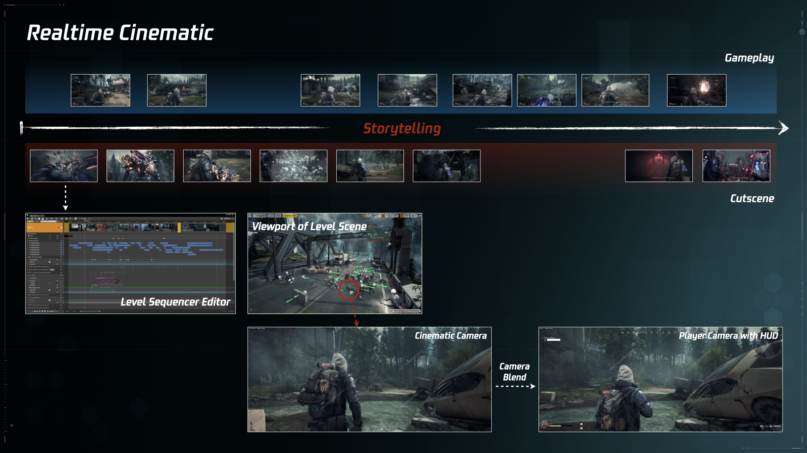

# Title

***
<!-- Start Document Outline -->

* [Sub Title A](#sub-title-a)
	* [Sub Title B](#sub-title-b)

<!-- End Document Outline -->
***

概念澄清
Spatial Audio
Object Based Audio
Dolby Atmos

目的
Endpoint OBA Realization
Multiple devices supported with less workload
Performance Optimization

整体流程
素材制作
……
混音棚混音

开发流程
Wwise structure details

## Sub Title A

[Link](https://en.wikipedia.org/wiki/Cutscene)

### Sub Title B

希辰  
2022.3.29

***