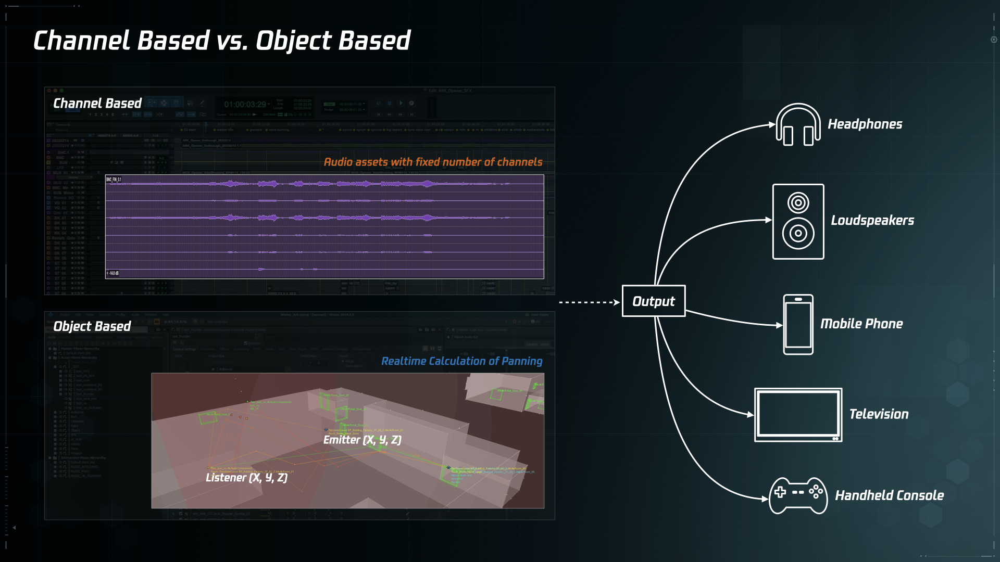
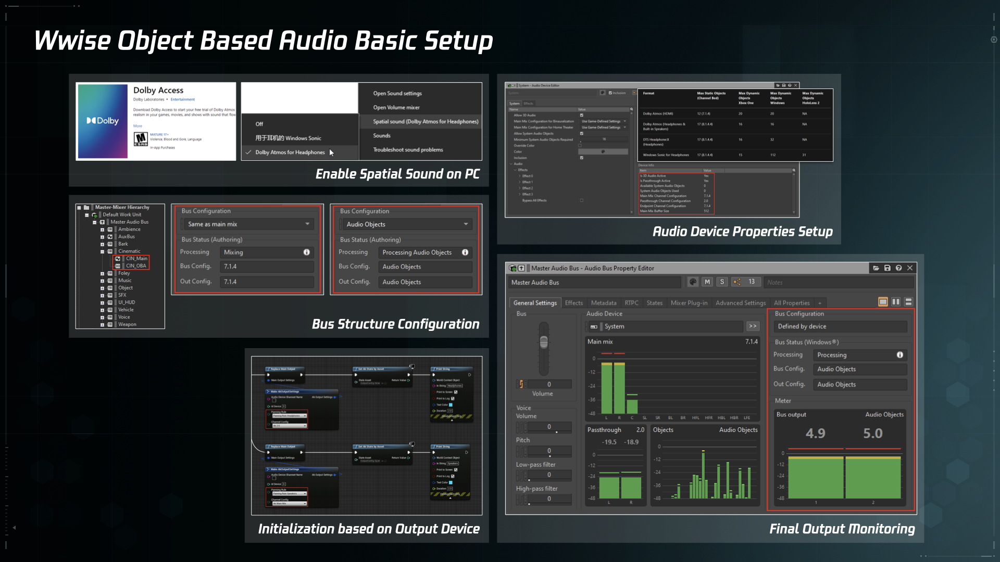
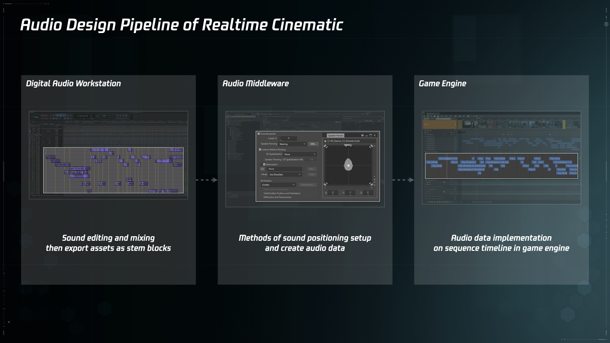
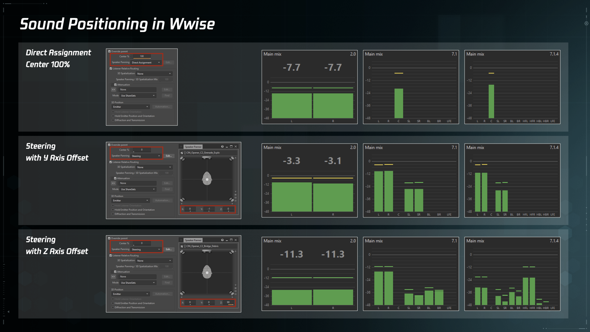
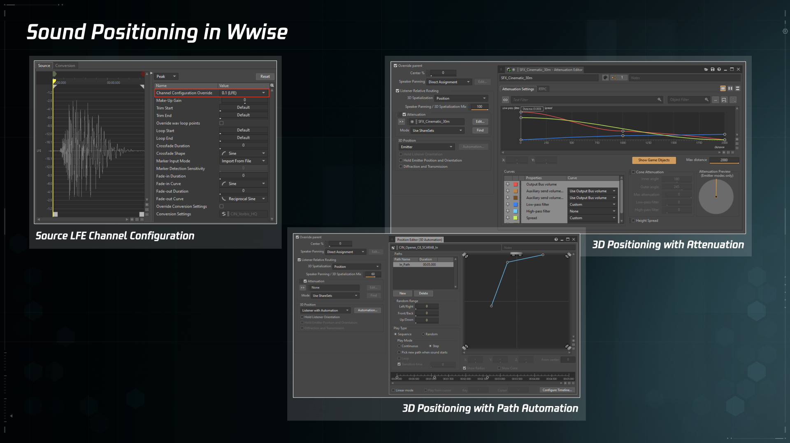
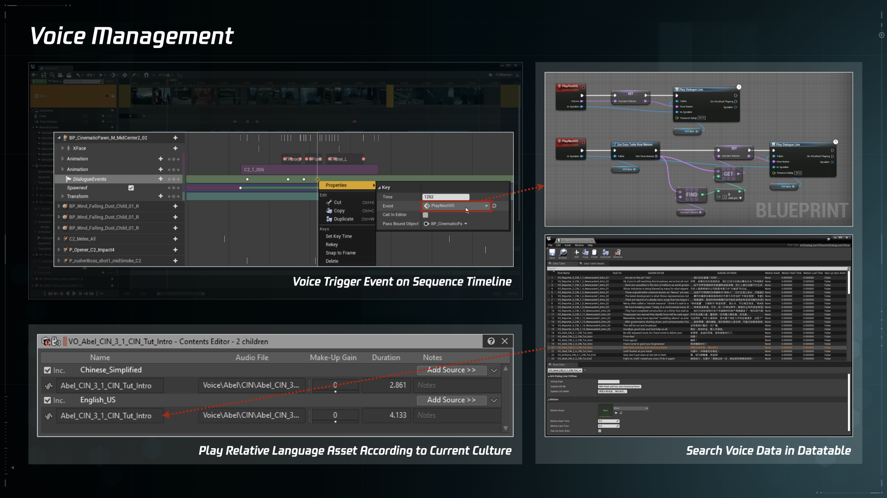
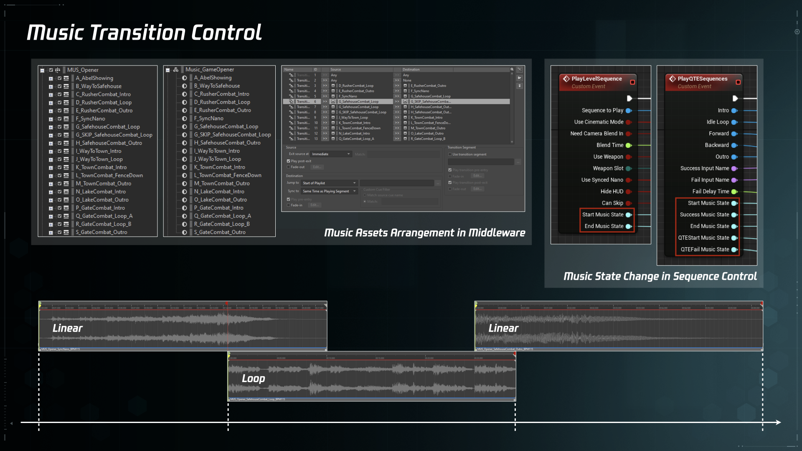
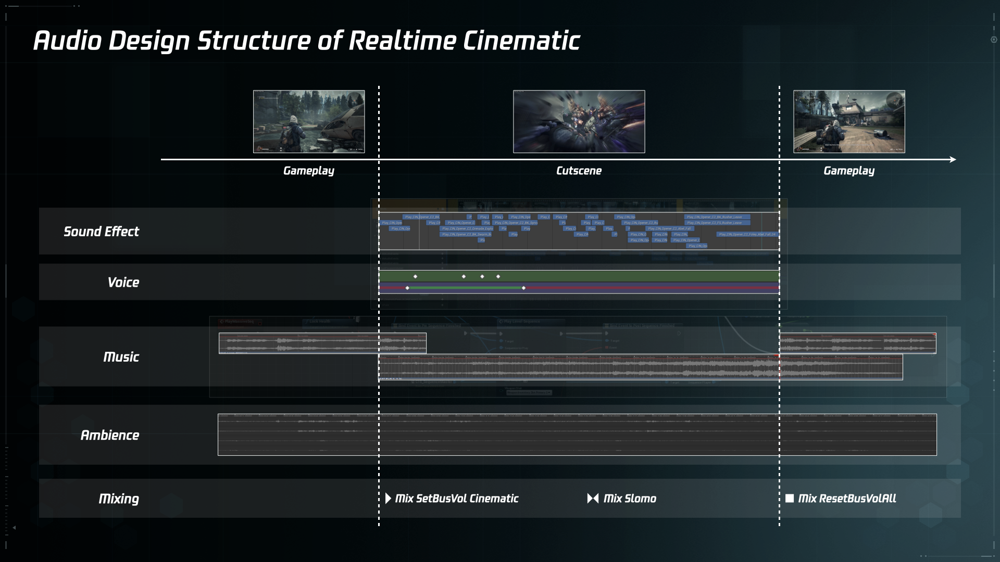

# 基于对象音频的游戏实时动画音频设计流程

***

<!-- Start Document Outline -->

* [Realtime Cinematic](#realtime-cinematic)
	* [The Specifications of Cinematic Sound](#the-specifications-of-cinematic-sound)
* [Object Based Audio](#object-based-audio)
	* [Channel Based vs. Object Based](#channel-based-vs-object-based)
	* [Wwise Object Based Audio Pipeline](#wwise-object-based-audio-pipeline)
* [Audio Design Pipeline](#audio-design-pipeline)
	* [Sound Positioning in Wwise](#sound-positioning-in-wwise)
	* [Voice Management](#voice-management)
	* [Music Transition Control](#music-transition-control)
	* [Mixing](#mixing)
* [Pros &amp; Cons](#pros--cons)

<!-- End Document Outline -->

***

本文将以游戏《SYNCED: Off-Planet》（重生边缘）中的开场剧情关卡为例，展开详述 UE 引擎结合 Wwise 音频中间件的开发环境下，基于对象音频（Object Based Audio）的游戏实时动画（Realtime Cinematic）音频设计流程。

## Realtime Cinematic

首先，本文讨论的实时动画是指穿插在游戏进行过程中非玩家控制的线性叙事部分 [Cutscene](https://en.wikipedia.org/wiki/Cutscene)（过场动画），称为 Realtime Cinematic 是为了强调其两个特点：一是 Realtime，区别于播放预渲染流媒体视频的实时方式，与游戏 Gameplay 部分之间有更强的联系，比如 Cutscene 与玩家镜头之间的无缝衔接和声音内容的平滑过渡，提供更为连续的体验感；二是 Cinematic，虽然具体的实现方式和工具流程有所区别，但无论是预渲染还是实时渲染，从最终的呈现效果上来看都是线性的影视化内容，因此实时动画音频设计的听感目标和评价标准与制作线性内容也是一致的，需要体现出线性内容声音设计在细节处理和整体混音上的特点，同时在技术规格上也要符合要求，比如对耳机和音箱等各类不同声道重放设备的适配。

如上图，《SYNCED: Off-Planet》开场约二十分钟的流程中有大小近十个 Cutscene，串联起了整个关卡各个阶段的剧情发展和情绪推动。在 UE 引擎中，每个 Cutscene 都是一个独立的 Level Sequence，其中包含了当前场景中的各个角色、物件和摄像机等对象，在各个对象基于时间轴的轨道上添加关键帧等内容来完成场景调度。多处 Cutscene 的开头和结尾都采用了 Camera Blend，实现动画镜头至玩家镜头的无缝衔接。

### The Specifications of Cinematic Sound

既然 Cutscene 是固定时长的线性序列，那是否可以在数字音频工作站中依据序列视频，直接制作出一条包含语音、音乐和音效且经过声音剪辑和混音的完整音频资源？虽然这种常规的 Channel Based（基于声道）线性内容声音制作方式能够最大程度地保证最终的整体效果，但是针对游戏实时动画的音频设计还是存在无法避免的局限，具体从以下几个方面来分析：

1. 语音是游戏中一个相对复杂的子系统，除了声音资源之外，还有字幕显示和多语言版本等问题需要共同考虑，因此 Cutscene 的语音需要统一在游戏整体的语音触发逻辑框架下，不能与其他声音内容直接混合。
1. 作为同一个叙事整体，Cutscene 和 Gameplay 部分之间需要顺畅的音乐过渡来转换情绪和推动剧情，使用 Wwise 音频中间件的互动音乐功能模块，设置 State 和 Transition 规则，可以方便地实现这一需求。因此 Cutscene 的音乐需要统一在整个关卡的音乐设计框架下，不能与其他声音内容直接混合。
1. 耳机是玩家最主要的重放设备，《SYNCED: Off-Planet》在开发阶段的混音策略和评价反馈也是以耳机重放为主的，但毫无疑问多声道重放环境也是需要匹配兼容的。Channel Based 音频资源的声道数目已经确定，如果以立体声格式来制作，那么在多声道重放环境下就会有明显的声道内容缺失；如果以最多声道数目的格式来制作，那么在较少声道的重放环境下就会出现自动下混的情况，实际响度和定位精度会出现偏差。而且，多声道格式音频资源中的低频、环绕和顶置声道通常会存在大量的空白片段，这些没有实际内容但是仍然占用了资源的数据，在资源分毫必争的游戏开发环境下来说，是一种极大的浪费。因此，Cutscene 的声音内容需要一种更为高效的声像定位方式来解决不同声道重放设备的适配问题，不适合直接使用整段 Channel Based 的音频资源。

除了上述三点从声音内容角度分析的局限之外，许多厂商和平台也都早在所谓 Object Based（基于对象）方向上提供了各自的解决方案，比如 Microsoft Spatial Sound 和 Dolby Atmos 等，允许带有更多信息的元数据在终端播放环节进行计算来实现更高精度和自由度的声像定位效果，这些技术标准的普及也对音频设计流程提出了新的要求。

## Object Based Audio

Object Based Audio 并不是一个有着严格定义的行业术语，在不同语境和讨论范围下都有着各自不同的含义。下面仅从与本文案例有关的两个角度来做解释说明，一是游戏音频设计中的 Object Based 基本逻辑，二是 Wwise 音频中间件 2021.1 版本引入的 Object Based Audio Pipeline。

### Channel Based vs. Object Based

声音重放技术从单声道、双声道立体声、多声道环绕声、三维环绕声等一路发展至今，是以不断增加声道数量的方式来营造更全面的沉浸感的。这种 Channel Based 的重放技术也决定了以电影为代表的线性媒体声音制作方式是直接围绕声道展开的，根据画面内容在数字音频工作站中的声轨上通过声像定位和音量调节等方式在时间轴上精细地控制每一时刻从各个声道中输出的声音内容，来模拟画面内容中各个元素与观众之间的方位与距离关系。  
游戏音频的终端输出也需要考虑基于各种声道制式的重放设备，比如耳机、手机、电视机和家庭影院等。然而由于非线性和交互性的特点，导致游戏无法像电影那样通过输出多个确定版本的音轨来保证在各种设备上的重放效果，时间和空间上的不确定性决定了游戏中的声音内容输出需要以实时计算的方式来判断，因此在开发阶段的设计思路也与线性媒体声音制作有所不同，主要是 Object Based，而非 Channel Based。游戏音频设计中的 Listener（听者）和 Emitter（发声体）对象概念就是这种思路的典型体现，根据两者之间的相对关系来计算分配到终端重放设备各个声道的内容。

上文提到许多厂商都已有了 Object Based 相关的解决方案，以 Dolby Atmos 为代表的在 Channel Based 线性内容制作流程中引入 Audio Object 的思路，其实就是在向游戏天然的音频设计逻辑看齐，尽可能摆脱声道因素对声音内容的影响。所以对于游戏中的实时动画而言，可以充分发挥游戏音频设计的先天优势，以 Objcet Based 的思路来完成这些线性内容的音频设计，基于时间轴的声音内容不再以固定声道数目的形式输出，而是分割成一个个基于发声对象的声音片段，交由音频中间件工具来计算发声对象与听者（即 Camera）之间的相对关系进行声像定位，同时在引擎的 Level Sequence 编辑器时间轴上完成相应时刻的触发。具体实现方案将在后面章节中详细展开。

### Wwise Object Based Audio Pipeline

Wwise 音频中间件在 2021.1 版本中引入了[针对 Audio Object 的新管线](https://blog.audiokinetic.com/authoring-for-audio-objects-in-wwise/)，定义了 Audio Objects、Main Mix 和 Passthrough Mix 三种输出通道，同时开放了更多有关 Audio Devices 的属性控制。这些新功能的引入让音频设计师在开发阶段对最终重放环节的实际效果有了更多的评估和控制，在保留原有信号流结构的同时，加入了对支持 Audio Object 重放设备的适配。

《SYNCED: Off-Planet》项目也在第一时间升级了中间件版本，并测试和实装了上述新功能。具体开发细节就不在本文展开了，之后有机会可以另起一文。感兴趣的朋友可以直接查阅[官方文档](https://www.audiokinetic.com/library/edge/?source=Help&id=object_based_audio_overview)。  
需要说明的是，仅从有限的主观评测结果来看，PC 平台上使用耳机配合 Windows Sonic for Headphones 或 Dolby Atmos for Headphones 设置的实际效果还不是很理想，与常规重放模式相比低频成分会有明显缺失，原因大概是因为通过立体声耳机回放会经过这些设置中的自动 Binaural 处理，这一部分的效果提升还需要各个厂商在用户终端环节提供更加细致的个性化配置，比如快速准确的个人 HRTF 生成方式等，以及。尽管如此，《SYNCED: Off-Planet》项目中还是应用了这些新功能，希望能给愿意尝新和有多声道重放条件的玩家们多一个选择。

## Audio Design Pipeline

通过上述两章的分析，明确了以 Object Based 思路来进行实时动画音频设计的必要性，接下来就是具体可行的设计流程了。如上图，主要分为三个环节：

1. 在数字音频工作站中根据序列视频完成声音剪辑工作，然后依据发声对象的种类和行为输出以 Mono 和 Stereo 简单声道格式为主的音频资源片段。同时按照常规的线性内容制作流程，输出一稿包含所有声音内容且完成混音的线性版本，用作最终效果的目标参考。
1. 将音频资源片段导入音频中间件并创建相应的音频数据。这一环节的重点是，在 Wwise 音频中间件里根据 Cutscene 中镜头与各个声音元素的关系来完成相应的 Positioning 设置，具体细节将在下文详细展开。
1. 在游戏引擎中完成音频数据的整合。在 UE 引擎 Sequencer 编辑器时间轴上相应时刻添加 Post Event 数据，以及自定义的 Voice Trigger 事件。另外在 Level Blueprint 中跟随 Cutscene 的播放逻辑设置相应的音乐切换逻辑。

### Sound Positioning in Wwise

如上图，以 Wwise 音频中间件内 Positioning 设置来举例说明在 2.0、7.1 和 7.1.4 三种不同声道数目重放环境下的声像定位情况。

1. 语音通常为单声道资源，在大多数无需特殊处理的情况下，声像位置都处于正中间以保证其清晰度，使用 Speaker Panning 中的 Direct Assignment 模式并配合 Center 100% 设置，确保语音的声像位置居中，并且在带有中置音箱的重放环境中始终从中置音箱输出。
1. 对于需要体现包围感的立体声资源来说，使用 Speaker Panning 中的 Steering 模式并调整 Y 轴 Offset，立体声回放环境下正常输出，环绕声回放环境下部分信号将会分配到环绕音箱中输出。
1. 对于需要体现高度感的立体声资源来说，使用 Speaker Panning 中的 Steering 模式并调整 Z 轴 Offset，立体声回放环境下正常输出，带有顶置音箱的环绕声回放环境下部分信号将会分配到顶置音箱中输出。

值得一提的细节是，使用 Speaker Panning 中的 Steering 而非 Balance-Fade 模式，原因主要有两点：一是，Steering 模式额外提供了针对高度的 Z 轴调整，而 Balance-Fade 模式只有 X 和 Y 两轴的调整；二是，两种模式内在的处理逻辑有所不同，Balance-Fade 模式是根据指定位置调整每个声道的响度（The volume of each channel is adjusted according to the position you specified），而 Steering 模式是根据指定位置分配声音信号（The sound is redistributed towards the position you specified）。而且由于 Balance-Fade 模式允许上混（Upmix），声道数少于输出总线的声音资源在被调整时会出现明显的响度降低，影响整体的混音平衡。
更多详细说明可以查阅[官方文档](https://www.audiokinetic.com/library/edge/?source=Help&id=working_with_2d_sound_music_and_motion_fx_objects)。

另外如上图，还有一些额外设置可以用来实现更复杂和细致的效果：

1. 单独制作用作低频效果的 LFE 声音资源，并将 Channel Configuration Override 设置成 0.1(LFE)，这样就能确保 LFE 声音只在带有 LFE 声道的重放环境下作为额外的内容进行播放。与直接将声音资源的低频部分送入 LFE 通道的方式相比，这种处理方式能够获得更为准确可控的低频效果。
1. 将 Cutscene 中的 Camera 作为 Listener，使用 3D Position Automation 功能，可以自定义 Emitter 相对于 Listener 的移动轨迹。或者直接利用 Listener 和 Emitter 之间的相对关系，使用 Attenuation 设置来处理声像定位等一系列的实时变化效果。

所以，通过以上设置的组合和参数调整，对同一个声音资源只需配置一种 Positioning 设置，就可以满足各种重放环境的声像定位需求了。

### Voice Management

在 UE 引擎中，每一句语音音频数据与字幕等其他相关信息组合在一起，以条目数据的形式保存在 Datatable 中。当 Sequence 时间轴上的 Voice Trigger Event 被触发时，会从 Datatable 中搜索相对应的语音音频数据，并根据当前的 Localization 播放对应语种的语音。

### Music Transition Control

在 Wwise 音频中间件中，将整个剧情关卡涉及到的音乐统一在同一个 Music Switch Container 结构下，并设置相对应的 State 切换和 Transition 规则。在引擎 Level Blueprint 中控制 Cutscene 起始和结束的同时进行 State 切换，实现 Cutscene 和 Gameplay 之间音乐的平滑衔接。针对 Skip 和 Respawn 等情况，也需要考虑触发逻辑上的保护措施。另外，对于像 [QTE](https://en.wikipedia.org/wiki/Quick_time_event)（快速反应事件）之类的特殊事件，充分利用 Transition 规则中的各种细节设置，复杂情况下也同样可以实现顺畅的切换效果。

### Mixing

在完成上述 Cutscene 中语音、音乐和音效的整合之后，还可以在整体混音上做一些更细致的处理。  
在 Wwise 音频中间件中创建一对 SetBusVolume 和 ResetBusVolume 的 Mix Event，用于各类声音在 Cutscene 播放期间的响度调整和复位。比如，直接屏蔽某些不该在 Cutscene 中出现的声音；稍微降低关卡场景中作为铺底的环境声的响度，给 Cutscene 中特有声音内容留出更多表现空间。这一对具有通用功能的 Mix Event 可以作为保护措施，配置在所有 Cutscene 起始和结束的时刻。  
对于像 Slomo 之类的特殊时刻，也可以创建一对特有的 Mix Event 在 Cutscene 中触发，通过对 Volume、Filter 和 Pitch 等参数的调整，实现更丰富的艺术表现效果。

## Pros & Cons

以上就是基于对象音频的游戏实时动画音频设计的具体流程，再用最后一章的篇幅来谈一谈本文设计流程的特点和仍需改进的地方：

1. 基于对象的声音资源制作和数据整合方式，在解决上述语音、音乐和声像定位等问题的同时，也能更好地适应游戏迭代式的开发节奏。音频设计在 Cutscene 制作前期尽早入场，根据进度有针对性地设计关键声音内容，与动画和特效等部门共同评估整体效果；针对开发过程中频繁的细节改动，只需快速修改相关资源和数据即可，无需重复输出整段内容。
1. 占用的数据资源较少。以《SYNCED: Off-Planet》剧情关卡中的主角出场为例，这一段较为复杂的 Cutscene 总长度为 84 秒，如果以 48kHz 24bit Wav 的精度输出，7.1.2 格式的整轨文件大约是 121.6MB，而采用本文设计流程，包含语音、音乐和音效在内的所有资源总共大约是 82.1MB，对比一下有近三分之一的减幅。
1. 与常规的线性内容声音制作方式相比，本文设计流程把原本在数字音频工作站中的声音剪辑和混音工序拆分成了三个环节，开发阶段中的参数调整和效果预览不够直观，数据整合的工作量也有所增加。需要额外开发一些小功能来打通工具之间的隔阂，比如将数字音频工作站中每个声音资源的起始时间码记录下来，用作之后在引擎 Sequence 编辑器时间轴上添加数据时的标记点，这样就可以省去手动对齐的重复劳动了。

游戏音频设计中有关声学基础、数字音频制作和录音技术等方面都是建立在电影声音设计基础之上的，而游戏的非线性和交互性的特点，使其在开发环节与电影制作产生了明显的区别，两者的差异主要体现在，电影声音是在 Channel Based 的数字音频工作站中完成的，游戏音频最终是在 Object Based 的游戏引擎中实现的。尽管目前电影和游戏这两种媒体的历史发展路径和声音实现方式上有所不同，但是在工具技术迭代发展和听音方式变化普及的趋势下，电影声音和游戏音频在设计思路和工具技术方面会不断互相影响进而可能趋于统一。而本文设计流程的最大意义可能在于，实践了以游戏音频设计的工具和思路进行线性影视内容声音制作的可能性。  
在 Virtual Reality 和 Virtual Production 领域，游戏开发相关的引擎工具和设计思路已经在影视内容制作中发挥着越来越重要的作用。大胆设想一下，以游戏引擎 Sequence 编辑器中横向 Timeline 纵向 Object 的形态为基础，在其中充分整合现有音频工具成熟的资源制作和数据处理手段，这样一种新型的 Object Based “数字音频工作站”说不定会在今后更多元的影视创作领域发挥更大的作用。

希辰  
2022.3.29

***