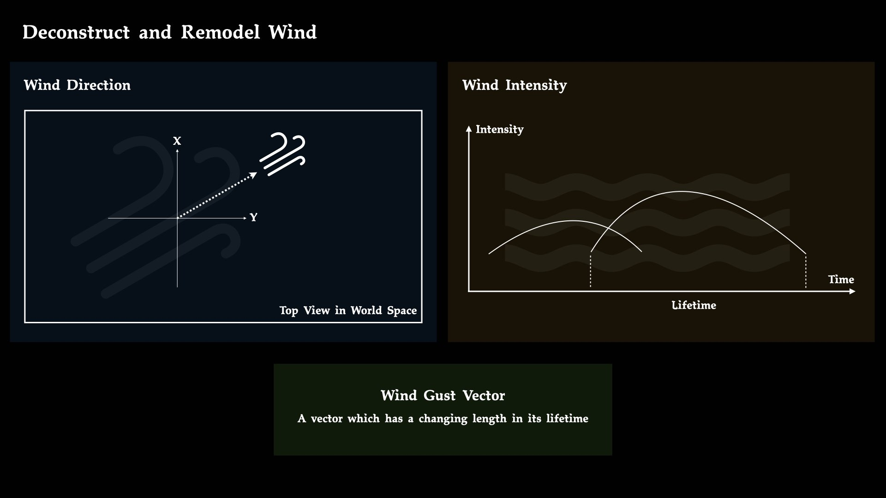
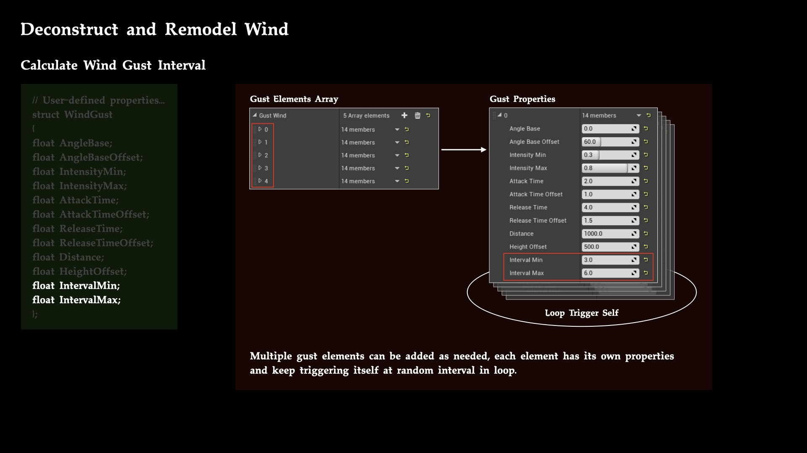

# 基于听者的动态风声设计

## Wind Blowing over Head

想象一下自己身处在一片竹林之中，徐徐微风穿梭在数米高的竹林之间，头顶上茂密的竹叶随风而动，在各个方位发出持续的窸窣声，偶尔一阵强风从后方吹来，竹叶的窸窣声由远及近拂过头顶，又从前方吹远淡去。这一小段场景所描述的听觉体验主要有两个重点，一是由竹林风声环绕四周带来的包围感，二是由间歇性的强风吹过头顶引起的方向感。本文将以实现上述听觉体验为目标，提供一种在传统环境声设计基础上进行改进的实现方案。

首先从文章标题中的几个概念入手，明确一下设计框架和限定条件：
1. 现实生活中所说的风声通常并不是风自身发出的声音，而是空间中的物体受空气流动影响而发出的声音。而游戏中的环境声设计，特别是在自然环境场景中，所谓风声其实是各类植被受风驱动而发出的声音，构成了环境声部分的基础层次，具体的声音素材制作也是围绕植被种类而展开的。
1. 单纯地制作一个听起来由远及近且有方向性的风声素材是相对容易的，通过调整声像来改变各个声道输出的信号量就可以进行大致的模拟，但是游戏中的风向和风速等参数都是可以实时且连续变化的，有限的素材数量难以满足所有复杂情况，因此本方案强调的动态设计是指，风声会以一种更偏程序性生成的方式根据风的实时参数而变化，同时游戏中的其他系统也可以利用这些数据配合声音来一起实现更全面的效果。
1. 如果从拟真的角度去设计一个实时风系统，需要引入流体力学方面的知识，Jos Stam 写于2003年的论文[《Real-Time Fluid Dynamics for Games》](https://www.dgp.toronto.edu/public_user/stam/reality/Research/pdf/GDC03.pdf)对此给出了详细的实现方案，Rupert Renard 在2019年 GDC 演讲[《Wind Simulation in God of War》](https://www.youtube.com/watch?v=dDgyBKkSf7A)也以实际游戏项目为例进行了分享，感兴趣的朋友可以自行查阅。而本文方案不会涉及任何有关流体力学的内容，主要是从声音效果的角度出发将影响风声的一些参数进行抽象和重构，以听者为中心（Listener-Centered）来设计一个简单的风系统。

```
开发环境与工具：
Unreal Engine 4.26
Audiokinetic Wwise 2021.1.4
```

## Deconstruct and Remodel Wind



从听者的角度来看，风的两个属性与实际感受最为相关：一是 Wind Direction，风的方向；二是 Wind Intensity，风的强度。持续的风可以看作是由一阵阵风 [Gust](https://en.wikipedia.org/wiki/Wind_gust) 此起彼伏地不断组合而成，每一个 Gust 都有着各自的 Direction，以及在各自的周期内随时间变化的 Intensity。因此，我们可以设计一个能够持续不断地产生 Gust 的系统，其中每一个 Gust 可以看作是一个长度随时间变化的向量，向量的参数由初始输入决定，所有 Gust Vector 向量之和就是当下整体风的向量 Wind Vector，接下来的具体过程也正是围绕如何计算这些向量来展开的。

### Calculate Wind Gust Direction


一般来说风在水平方向上的运动比较直观可感，同时也是为了简化计算，暂且忽略风向在垂直方向 Z 轴上的变化，因此在计算 Gust Direction 的时候，只需计算在 XY 平面上的角度变化就可以了。如上俯视图所示，规定世界坐标系内 X 正轴方向(1, 0)为0度，顺时针方向展开范围为0至360度，目标风向角度 TargetAngle 由输入参数 AngleBase 结合 AngleBaseOffset 在一定范围内随机而得到，这样就可以在单位圆上通过三角函数来求得 Gust 的单位向量了。  
为了后续能更直观地基于听者来使用这些参数，可以进一步计算 Gust 单位向量与镜头朝向向量 CameraForwardVector 两者间的关系，即求出风向相对于听者的入射角度 IncidentAngle，并规定听者左半边为-180至0度，右半边为0至180度。

```
FVector CameraFwdVector = PlayerCamera->GetActorForwardVector();
FVector2D CameraDirVector = FVector2D(CameraFwdVector.X, CameraFwdVector.Y);

float IncAglCrossProd = WindVector.X * CameraDirVector.Y - WindVector.Y * CameraDirVector.X;
float IncAglDotProd = WindVector.X * CameraDirVector.X + WindVector.Y * CameraDirVector.Y;

WindIncidentAngle = 180 - FMath::RadiansToDegrees(FMath::Atan2(FMath::Abs(IncAglCrossProd), IncAglDotProd));
if (IncAglCrossProd < 0)
{
    WindIncidentAngle = -WindIncidentAngle;
}
```

上述代码参考自视频 [Get The Angle Between 2D Vectors](https://www.youtube.com/watch?v=_VuZZ9_58Wg)，通过点乘和叉乘相关的运算并配合叉乘的正负性判断，可以快速地求出两向量之间的夹角，并转换为范围为-180至180之间的数值。

### Calculate Wind Gust Intensity


借用声音工作者应该都了解的 ADSR 概念，Gust 从起始到结束的整个周期 Lifetime 中，强度变化的曲线包络可以分成两个阶段，强度从0变化到最大目标强度 TargetIntensity 的阶段称为 Attack，又从 TargetIntensity 变化到0的阶段称为 Release。TargetIntensity、AttackTime 和 ReleaseTime 这三个数值由输入参数得到，可以根据需要表征出各种不同类型 Gust 的强度曲线包络。

```
void FWindGust::GustInit()
{
    float IntensityTarget = FMath::RandRange(IntensityMin, IntensityMax);
    float DirAngleTarget = FMath::RandRange(AngleBase - AngleBaseOffset, AngleBase + AngleBaseOffset);
    float RadianTarget = FMath::DegreesToRadians(DirAngleTarget);
    
    VectorTarget = FVector2D(FMath::Cos(RadianTarget), FMath::Sin(RadianTarget)) * IntensityTarget;
    
    AttackTimeTarget = FMath::RandRange(AttackTime - AttackTimeOffset, AttackTime + AttackTimeOffset);
    ReleaseTimeTarget = FMath::RandRange(ReleaseTime - ReleaseTimeOffset, ReleaseTime + ReleaseTimeOffset);
    
    Lifetime = AttackTimeTarget + ReleaseTimeTarget;
    Timer = 0.f;
}
```

```
void FWindGust::GustTick(float DeltaTime)
{
    Timer += DeltaTime;
    
    // Attack...
    if (Timer < AttackTimeTarget)
    {
        GustVector = FMath::InterpEaseInOut<FVector2D>(FVector2D::ZeroVector, VectorTarget, Timer / AttackTimeTarget, InterpExp);
    }
    // Release...
    else if (Timer >= AttackTimeTarget && Timer < Lifetime)
    {
        GustVector = FMath::InterpEaseInOut<FVector2D>(VectorTarget, FVector2D::ZeroVector, (Timer - AttackTimeTarget) / ReleaseTimeTarget, InterpExp);
    }
}
```

上述代码通过变量 Timer 作为计时器配合 `FMath::InterpEaseInOut()` 函数来计算 Gust Vector 在 Lifetime 内的变化，改变输入的数值参数就可以快速获得类型各异且带有范围随机的结果。

### Calculate Wind Gust Path


获得上述风的方向和强度之后，就相当于完成了对 Gust Vector 的运算，接下来计算 Gust 的移动路径就非常直接了。Gust 将从以听者位置为圆心、以 Distance 为半径的圆周上的一端开始移动，穿过圆心并结束于另一端。同时，HeightOffset 参数可以控制整条路径在高度上相对于听者的变化，比如表现草地可以设置在听者位置之下，表现树叶则可以设置在听者位置之上。

### Calculate Wind Gust Interval



## Trigger and Control Sound


## Summary


此系统的可扩展性

强度控制声音的响度和LPF，还只是非常简单的模拟

希辰  
2021.12.3

***