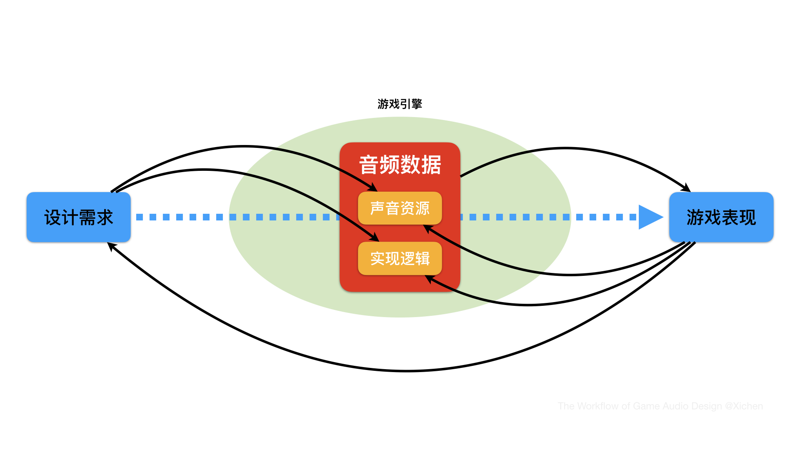
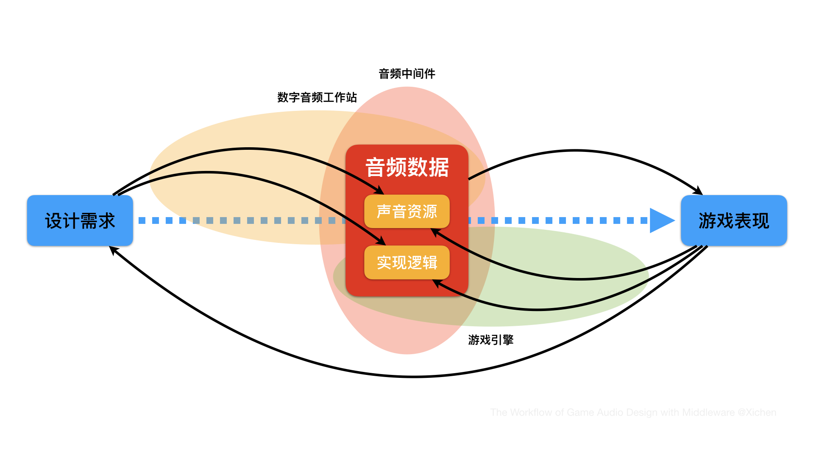

# 游戏音频设计的工作流

传统的线性媒体声音设计作为一项基本技能，大多数想从事游戏音频设计的朋友们对其工作方式和流程多少是有所了解的，毕竟想要找工作的话，一份视频作品 Demoreel 肯定是少不了的。相较而言游戏开发则更为复杂，声音设计专业出身的朋友们难以独立完成，项目合作的机会也比较少，因此往往不太了解游戏音频设计是如何在实际的游戏项目中开展工作的。所以，我想通过图例的方式来梳理一下游戏音频设计的工作流，重点聊一聊音频设计受游戏开发流程影响而产生的工作特点。

依据上图来高度概括的话，游戏音频设计的实现目标就是，根据**设计需求**制作出相应的**音频数据**，并将其整合到游戏引擎中去，与其它设计元素共同形成最终整体的**游戏表现**。

首先来解释一下这句话中提到的三个概念。
* 设计需求
与美术风格的概念设计类似，游戏的音频设计也需要在项目早期确立 Concept Design，其中既包括了对语音、音乐和音效在艺术风格上的选择，也包含了实现方式和工具管线等技术方面的调研，并在此基础上跟随开发进度为游戏中的各个元素制定出具体的音频数据需求。
* 游戏表现
现实一点来说，声音在大多数类型的游戏中往往算不上是核心玩法的组成部分，玩家在无声环境下其实也是可以进行游戏的。某些声音元素的表现重点更多的是在配合游戏中的视觉表现并提供听觉上的信息提示，因此游戏音频设计在实际开发流程中需要与各个部门进行频繁沟通，且对他们的工作成果有一定的依赖关系，这也是影响游戏音频设计工作流程的重要因素。
* 音频数据
为了更好地表达游戏音频设计的特点，并且与传统声音设计有所区分，我把**音频数据**（Audio Data）定义为由**声音资源**（Sound Asset）和**实现逻辑**（Implementation Logic）两部分组成。其中，声音资源是指在数字音频工作站（DAW）中制作完成并导出的、以 Wav 格式为主的声音文件，而实现逻辑考虑的则是与声音资源何时触发与停止、如何变化与传播等相关问题，这两者在游戏引擎中共同组成了所谓的音频数据的概念。

接下来将围绕上述概念梳理一下游戏音频设计中的一些重要环节，即图中带方向箭头的黑色曲线。
* 设计需求 -> 声音资源 & 实现逻辑
简单来说，在实现某个具体的设计需求时，考虑的问题其实就是播放什么声音和怎么播放的问题，分别对应的就是声音资源和实现逻辑，这一点是非常容易理解的。需要注意的是，声音资源和实现逻辑之间的关系是同时从设计需求出发来考虑的、互相影响的平行关系，而不是先后关系：不同的实现逻辑会直接影响到声音资源的制作方式，而声音资源的组织形式往往也会影响到实现逻辑的优化。以枪声为例，枪械射速驱动和固定片段播放这两种不同的触发方式，直接决定了枪声资源是要做成完整单发的形式还是可循环片段的形式，而在枪声层次上的细分也对实现逻辑提出了要求，需要保证各个层次能在同一时刻被精准触发和停止。
而在这个阶段，游戏音频设计师要做的工作也大致分成两个部分：一是，与游戏设计师和相关工种的同事进行沟通，明确设计需求并制作出相应的声音资源；二是，清晰明确地将实现逻辑传达给程序员，在游戏引擎中完成相应的功能开发和验证。
* 音频数据 -> 游戏表现
在完成声音资源的制作和实现逻辑的开发之后，接下来就到了把音频数据在游戏引擎中与相对应的设计元素整合起来共同测试游戏表现的时候了。其中，游戏音频设计师还需要在混音标准和性能指标等方面去做整体性的设置与调整。
在这个阶段，谈一谈我认为比较重要的两个观念。第一，正如上文提到的，游戏音频设计师需要与各个工种进行沟通制定具体的设计需求，因此音频数据也会被相应地整合到各个相对独立的功能组件中去，比如地图关卡、动画和特效等，它们之间的整合方式存在着比较大的差异。我觉得，既然游戏音频设计师是对最终的声音表现负责，那么音频数据整合作为其中的一个环节，自然就是分内之事，而不应该全权交由其它工种同事来处理。另外，游戏音频设计师对整合工作有更多的把控，其实是为自己在后续 Debug 环节的工作提供了更多的自主性。第二，跳出自己作为开发者的角色，尽可能从玩家视角去测试和评价整体的游戏表现。有些时候我们可能会太过坚持所谓专业上的“正确”，而忽视了玩家体验到的实际感受。比较好的实践方式是，亲身投入到日常的测试工作中去，与开发组同事和参与阶段性测试的玩家沟通，听一听他们的真实想法与感受，我相信一定会有所收获的。
* 游戏表现 -> 声音资源 & 实现逻辑 & 设计需求
在测试和评估游戏表现之后，各种问题自然也就浮现出来了，可能是声音资源本身无法匹配视觉元素改动之后的效果，可能是实现逻辑不够严谨导致了触发错误，当然也有可能是整体表现不如预期，那么就要回到设计需求的环节重新开始。
在这个 Debug 阶段，游戏音频设计师最重要的能力就是，熟练使用各种调试（Profiling）工具，快速地找到问题到底出在哪个环节。比如最典型的问题就是声音没放出来，首先判断是不是声音资源本身或者数据整合上的问题，是的话那就自行解决；如果排除了这些环节，再从实现逻辑等更深层次的角度去考虑，尽可能缩小出错范围，并将相应问题和调查结果详细表述成非声音专业背景的人也能听得懂的状态，然后再寻找程序员或相关工种的同事来一同解决。

以上就是根据图例所示，以音频数据为核心展开梳理的游戏音频设计工作流。而游戏开发本身有一个特点就是**迭代**（Iteration），需要不断进行重复性的工序来无限逼近预想的表现效果，游戏音频设计作为其中一环，自然也是要遵循这个规律的，因此上述的工作流其实是自始至终地贯穿在游戏开发的每一个阶段中的。

现在，游戏音频中间件（Audio Middleware）工具似乎越来越成为大多数开发团队的标配了，其日益丰富的功能极大地提高了游戏音频设计师的工作效率，某种程度上也多少改变了工作流程。
依上图，我认为音频中间件的价值主要体现在两点：一是，音频中间件提供了更有针对性的功能和管线来全方位地管理海量的声音资源，以满足各种变化且复杂的开发环境的要求。同时，某些音频中间件与数字音频工作站之间的联动功能，可以让游戏音频设计师对声音资源进行更加快捷方便的调整。二是，音频中间件完成了一部分的实现逻辑，省去了在游戏引擎中重复造轮子的成本，游戏音频设计师可以在图形化界面的软件中实现某些复杂的音频功能，并在游戏引擎中快速地进行验证与调试。这极大地减少了程序员的工作量，而且也给游戏音频设计师在创意上提供了更多的试验空间。

任何有关设计的工作流，很大程度上都是由工具来决定的。虽然工具的更新换代会很快，但就目前游戏开发的框架结构和技术水平而言，本文所讨论的游戏音频设计工作流还是具有普适性的。

希辰
2020.9.1

***